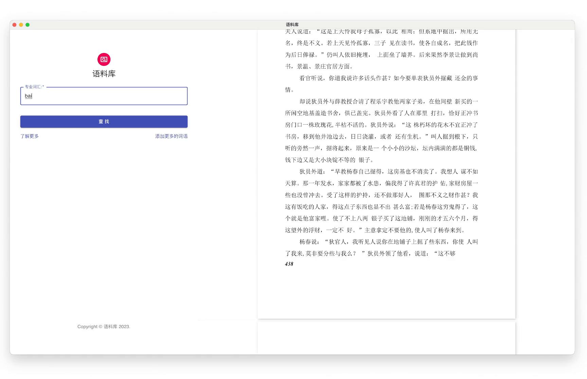
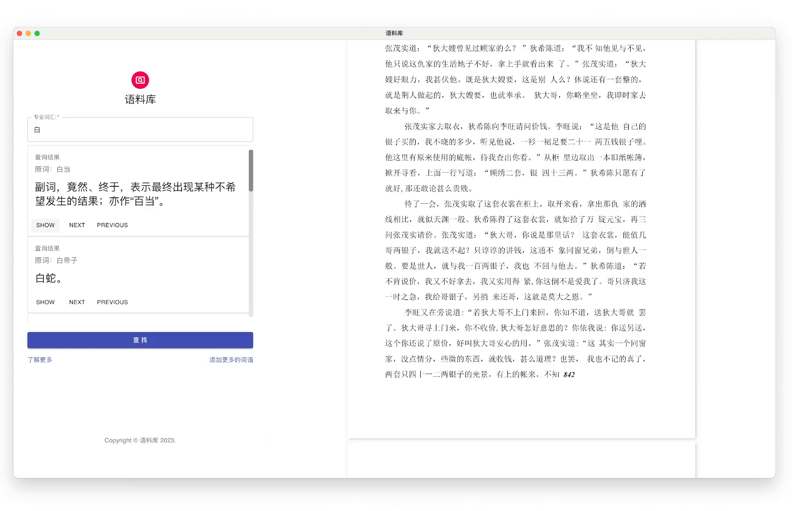

# 《醒世姻缘转》
方言词及熟语方言性研究小组

## 简介
《醒世姻缘传》作为十七世纪的一部重要世情小说，于明末清初用山东地区方言写成，书中保留大量口语词汇。在汉语史中口语和文言长期并存的状况下，《醒世姻缘传》使用并反映该时期及地域的口语，因此能够较为真实地反映断代方言词汇使用面貌。本项目以《醒世姻缘传》一书为语料来源，对其中的方言词进行词汇层面研究，对其中熟语的方言特征进行考察与研究，并建立专书语料库。

## 展示
### 正常阅读《醒世姻缘转》

### 搜索你想知道的词意

### 跳转到文本部分，进行阅读

## 实现细节
请查看[实现路径](docs/README.md)
